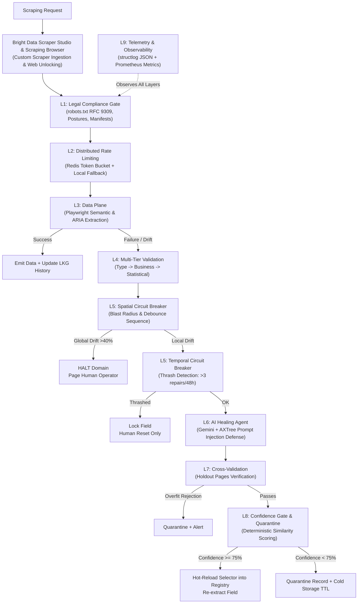

# Self-Healing Web Scraping Pipeline

A production-grade, 9-layer data extraction pipeline in Python that extracts structured data via semantic locators, integrates with **Bright Data Scraper Studio & Scraping Browser**, detects layout drift, auto-repairs broken selectors using AI (Google Gemini), and fails safe toward halting and alerting humans.

[](https://github.com/callbyIshant/self-healing-WebScarper)
[](https://brightdata.com/)
[](tests/)
[](https://python.org)
[](https://playwright.dev/python/)
[](https://ai.google.dev/)
[](LICENSE)

---

## Hackathon Submission Highlights ("Into the Scrape-Verse")

| Requirement | Project Implementation |
|---|---|
| **Required Technology** | Integrates with **Bright Data Scraper Studio** (`src/scraper/integrations/bright_data.py`) to trigger and ingest custom scrapers, and connects Playwright over CDP to **Bright Data Scraping Browser** for anti-bot & CAPTCHA unblocking. |
| **Custom Scraper** | Custom scraper created in Scraper Studio targeting public e-commerce catalogs with multi-tier validation and live fallback. |
| **Public Data Compliance** | Strictly extracts public data (`books.toscrape.com`), respects `robots.txt` (RFC 9309 via `protego`), and complies with ethical scraping standards. |
| **Structured Output** | JSON datasets provided in [`examples/output/books_sample_output.json`](examples/output/books_sample_output.json) and [`examples/output/bright_data_custom_scraper_output.json`](examples/output/bright_data_custom_scraper_output.json). |
| **AI Assistant Disclosure** | AI coding assistant was used to accelerate scaffolding, multi-agent security reviews, and test generation under human developer direction and architecture design. |

---

## Architecture Overview



---

## Bright Data Scraper Studio Integration

The pipeline connects to Bright Data through two core interfaces in [`src/scraper/integrations/bright_data.py`](src/scraper/integrations/bright_data.py):

### 1. Custom Scraper Studio API Ingestion
Allows triggering custom scrapers built inside **Bright Data Scraper Studio**, polling execution progress, and piping output into the 9-layer Self-Healing pipeline:
```python
from scraper.integrations.bright_data import BrightDataScraperStudioClient

client = BrightDataScraperStudioClient()

# Trigger custom Scraper Studio collector and wait for structured records
results = await client.collect_sync(
    inputs=[{"url": "https://books.toscrape.com/catalogue/a-light-in-the-attic_1000/index.html"}],
    scraper_id="custom_ecommerce_books_scraper"
)
```

### 2. Bright Data Scraping Browser (CDP Automation)
Connects Playwright over Chrome DevTools Protocol (CDP) to Bright Data's proxy cloud with automated fingerprint rotation and CAPTCHA solving:
```python
from playwright.async_api import async_playwright
from scraper.integrations.bright_data import BrightDataScraperStudioClient

client = BrightDataScraperStudioClient()

async with async_playwright() as p:
    # Connect Playwright to Bright Data Scraping Browser
    browser = await client.connect_scraping_browser(p)
    page = await browser.new_page()
    await page.goto("https://books.toscrape.com")
```

---

## 9-Layer Safety Architecture

| Layer | Component | Primary Responsibility | Failure-Safe Behavior |
|:---:|---|---|---|
| **L1** | **Legal & Compliance Gate** | RFC 9309 `robots.txt` enforcement via `protego`, HMAC-SHA256 signed legal manifests for commercial postures. | Defaults to `STRICT_COMPLIANCE` on any missing/corrupt signal. 403s and CAPTCHAs are hard stops. |
| **L2** | **Distributed Rate Limiting** | Atomic Redis Lua token bucket with sub-millisecond manifest expiration verification. | Defaults to **fail-throttled** in-memory token bucket per worker if Redis is unavailable. |
| **L3** | **Data Plane (Extraction)** | Playwright semantic locators (`get_by_role`, `get_by_label`), CSS/XPath fallbacks, sliding window of 5 LKG snapshots. | Fully deterministic, no external network or LLM calls on hot path. |
| **L4** | **Multi-Tier Validation** | 1. Generic type/format validation<br/>2. Domain business rules<br/>3. Rolling statistical anomaly detection (Welford's z-score). | Short-circuits on failure; strips auto-approval and routes to drift analysis. |
| **L5** | **Circuit Breakers** | **Spatial**: Blast-radius detection (>40% fields fail -> 3-retry debounce -> HALT).<br/>**Temporal**: Thrash control (>3 repairs in 48h -> lock field). | Requires authenticated human operator reset to clear temporal lock. |
| **L6** | **Self-Healing AI Agent** | Gemini LLM repair agent enclosed in anti-prompt-injection delimiters `<untrusted_scraped_content>`. Strips hidden elements and executable nodes. | LLM proposes candidate selector; confidence score is **deterministically calculated**, never self-assessed by LLM. |
| **L7** | **Cross-Validation** | Tests repaired selector against 3–5 holdout pages from the same domain to prevent single-page overfitting. | Rejects repair if holdout pages fail; signals global drift if failure is uniform across domain. |
| **L8** | **Confidence Gate & Quarantine** | Compares score against calibrated threshold (0.75). Quarantines unconfident extractions with UUIDs into cold storage (7-day TTL). | Below threshold extractions are nulled and quarantined; supports idempotent replay without duplicates. |
| **L9** | **Telemetry & Observability** | Structured JSON logging (`structlog`) with PII/credential scrubbing, Prometheus metrics exporter. | Full event traceability with correlation IDs (`scrape_run_id`, `domain`, `field`). |

---

## Security Hardening

- **SSRF Protection (`SSRFGuard`)**: Strict protocol whitelisting (`http`/`https`), DNS resolution verification against blocked private CIDRs (`127.0.0.0/8`, `10.0.0.0/8`, `172.16.0.0/12`, `192.168.0.0/16`, `169.254.0.0/16`, IPv6 loopbacks), and octal/hex/IPv4-mapped-IPv6 bypass detection. Fail-closed on DNS errors.
- **PII Redaction (`PIIRedactor`)**: Automated in-line regex scrubbing of email addresses, phone numbers, credit card numbers, and SSNs before database persistence or log output.
- **Prompt Injection Mitigation (`AXTreeSanitizer`)**: Prunes unrendered, hidden, zero-sized elements, `<script>`, `<iframe>`, inline event handlers, and zero-width characters before LLM exposure.
- **Selector Injection Protection (`InputSanitizer`)**: AST validation of synthesized CSS and XPath selectors; blocks dangerous XPath functions (`document()`, `system-property()`).

---

## Quick Start

### Prerequisites
- Python 3.11+
- Playwright (`playwright install chromium`)
- Google Gemini API Key
- Bright Data Account & API Key (for Scraper Studio integration)

### Installation

```bash
# Clone the repository
git clone https://github.com/callbyIshant/self-healing-WebScarper.git
cd self-healing-WebScarper

# Install dependencies
pip install -e ".[dev]"

# Install Chromium browser for Playwright
playwright install chromium

# Configure environment
cp .env.example .env
# Edit .env with your GEMINI_API_KEY and BRIGHT_DATA_API_KEY
```

---

## Running & Testing

### 1. Launch the Interactive Web UI Dashboard (Recommended)
Launch the modern Claude/Codex-inspired web dashboard featuring real-time 9-layer visual progression, live AI repair diffs, and universal prompt bar:
```bash
python -m scraper.cli ui
```
*Opens automatically at `http://localhost:8000`.*

### 2. Universal Zero-Code Scraper (CLI)
Point to **any URL** on the internet — auto-synthesizes schemas via Gemini and runs the 9-layer self-healing pipeline:
```bash
python -m scraper.cli auto https://quotes.toscrape.com/ "extract quote text, author, and tags"
```

### 3. Run the Live AI Self-Healing Demo (Hero Demo for Judges)
Simulates layout drift on a live target site by injecting a broken selector, then invokes the Gemini AI agent to analyze the accessibility tree, cross-validate against holdout pages, and hot-reload the repaired locator:
```bash
python scripts/test_healing.py
```

### 4. Run the Automated Test Suite (66 Tests)
```bash
python -m pytest tests/ -v
```

---

## CLI Reference

```bash
# List all configured domains and extraction schemas
python -m scraper.cli list-domains

# Inspect the quarantine queue for pending extractions
python -m scraper.cli quarantine-list

# Reset a tripped temporal circuit breaker (thrash lock)
python -m scraper.cli reset-breaker books.toscrape.com price --reset-by "operator_name"

# Start the Prometheus metrics server
python -m scraper.cli metrics --port 9090
```

---

## Example Structured Output

Example output from [`examples/output/books_sample_output.json`](examples/output/books_sample_output.json):

```json
{
  "request_id": "req-9b8f2c10",
  "domain": "books.toscrape.com",
  "url": "https://books.toscrape.com/catalogue/a-light-in-the-attic_1000/index.html",
  "status": "SUCCESS",
  "extracted_data": {
    "title": "A Light in the Attic",
    "price": 51.77,
    "currency": "GBP",
    "availability": "In stock (22 available)",
    "rating": "Three",
    "description": "It's hard to imagine a world without A Light in the Attic..."
  },
  "validation": {
    "type_checks_passed": true,
    "business_rules_passed": true,
    "statistical_anomaly_detected": false
  },
  "drift_detected": false,
  "quarantined": false
}
```

---

## Technology Stack

- **Scraper Infrastructure & Proxy**: [Bright Data Scraper Studio](https://brightdata.com/) & Scraping Browser
- **Browser Automation**: [Playwright Python](https://playwright.dev/python/)
- **Data Validation**: [Pydantic v2](https://docs.pydantic.dev/)
- **AI / LLM**: [Google Gemini](https://ai.google.dev/) (`google-genai`)
- **Document Store**: SQLite (WAL Mode, `aiosqlite`)
- **Rate Limiting**: Redis Token Bucket (Lua)
- **Robots.txt Engine**: [Protego](https://github.com/scrapy/protego) (RFC 9309)
- **Telemetry**: [structlog](https://www.structlog.org/) + [prometheus-client](https://github.com/prometheus/client_python)
- **CLI Interface**: [Click](https://click.palletsprojects.com/) + [Rich](https://rich.readthedocs.io/)

---

## License

MIT License. See [LICENSE](LICENSE) for details.
