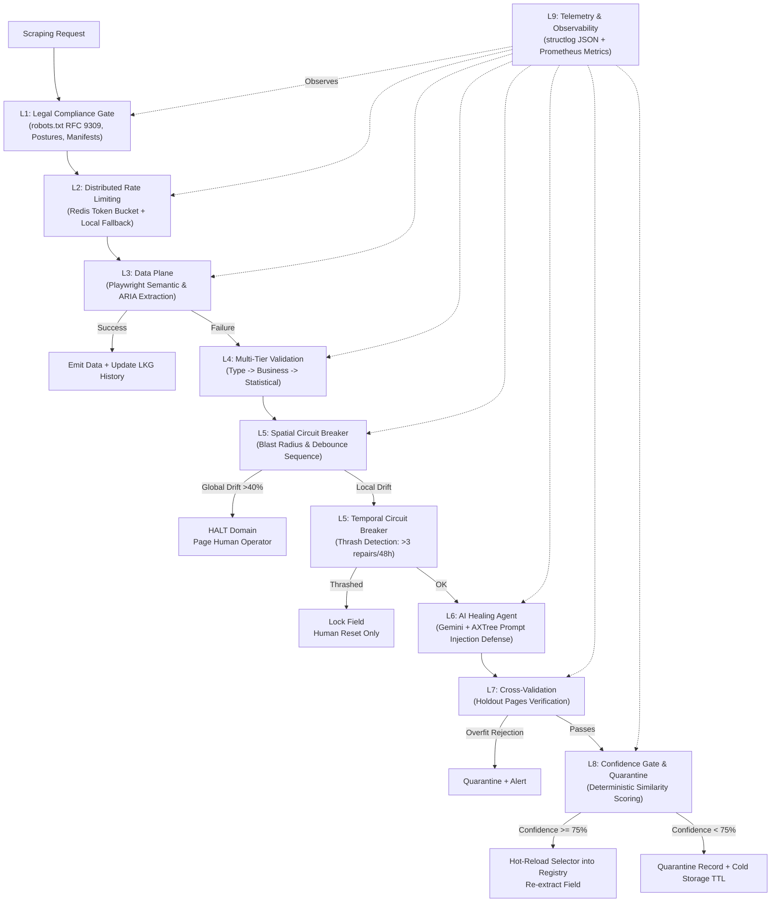

# Self-Healing Web Scraping Pipeline

A production-grade, 9-layer data extraction pipeline in Python that extracts structured data via semantic locators, detects layout drift, auto-repairs broken selectors using AI (Google Gemini), and fails safe toward halting and alerting humans.

[](tests/)
[](https://python.org)
[](https://playwright.dev/python/)
[](https://ai.google.dev/)
[](LICENSE)

---

## Architecture Overview



---

## 9-Layer Safety Architecture

| Layer | Component | Primary Responsibility | Failure-Safe Behavior |
|:---:|---|---|---|
| **L1** | **Legal & Compliance Gate** | RFC 9309 `robots.txt` enforcement via `protego`, HMAC-SHA256 signed legal manifests for commercial postures. | Defaults to `STRICT_COMPLIANCE` on any missing/corrupt signal. 403s and CAPTCHAs are hard stops. |
| **L2** | **Distributed Rate Limiting** | Atomic Redis Lua token bucket with sub-millisecond manifest expiration verification. | Defaults to **fail-throttled** in-memory token bucket per worker if Redis is unavailable. |
| **L3** | **Data Plane (Extraction)** | Playwright semantic locators (`get_by_role`, `get_by_label`), CSS/XPath fallbacks, sliding window of 5 LKG snapshots. | Fully deterministic, no external network or LLM calls on hot path. |
| **L4** | **Multi-Tier Validation** | 1. Generic type/format validation<br/>2. Domain business rules<br/>3. Rolling statistical anomaly detection (Welford's z-score). | Short-circuits on failure; strips auto-approval and routes to drift analysis. |
| **L5** | **Circuit Breakers** | **Spatial**: Blast-radius detection (>40% fields fail -> 3-retry debounce -> HALT).<br/>**Temporal**: Thrash control (>3 repairs in 48h -> lock field). | Requires authenticated human operator reset to clear temporal lock. |
| **L6** | **Self-Healing AI Agent** | Gemini LLM repair agent enclosed in anti-prompt-injection delimiters `<untrusted_scraped_content>`. Strips hidden elements and executable nodes. | LLM proposes candidate selector; confidence score is **deterministically calculated**, never self-assessed by LLM. |
| **L7** | **Cross-Validation** | Tests repaired selector against 3–5 holdout pages from the same domain to prevent single-page overfitting. | Rejects repair if holdout pages fail; signals global drift if failure is uniform across domain. |
| **L8** | **Confidence Gate & Quarantine** | Compares score against calibrated threshold (0.75). Quarantines unconfident extractions with UUIDs into cold storage (7-day TTL). | Below threshold extractions are nulled and quarantined; supports idempotent replay without duplicates. |
| **L9** | **Telemetry & Observability** | Structured JSON logging (`structlog`) with PII/credential scrubbing, Prometheus metrics exporter. | Full event traceability with correlation IDs (`scrape_run_id`, `domain`, `field`). |

---

## Security Hardening

- **SSRF Protection (`SSRFGuard`)**: Strict protocol whitelisting (`http`/`https`), DNS resolution verification against blocked private CIDRs (`127.0.0.0/8`, `10.0.0.0/8`, `172.16.0.0/12`, `192.168.0.0/16`, `169.254.0.0/16`, IPv6 loopbacks), and octal/hex/IPv4-mapped-IPv6 bypass detection. Fail-closed on DNS errors.
- **PII Redaction (`PIIRedactor`)**: Automated in-line regex scrubbing of email addresses, phone numbers, credit card numbers, and SSNs before database persistence or log output.
- **Prompt Injection Mitigation (`AXTreeSanitizer`)**: Prunes unrendered, hidden, zero-sized elements, `<script>`, `<iframe>`, inline event handlers, and zero-width characters before LLM exposure.
- **Selector Injection Protection (`InputSanitizer`)**: AST validation of synthesized CSS and XPath selectors; blocks dangerous XPath functions (`document()`, `system-property()`).

---

## Quick Start

### Prerequisites
- Python 3.11+
- Playwright (`playwright install chromium`)
- Google Gemini API Key

### Installation

```bash
# Clone the repository
git clone https://github.com/callbyIshant/self-healing-WebScarper.git
cd self-healing-WebScarper

# Install dependencies
pip install -e ".[dev]"

# Install Chromium browser for Playwright
playwright install chromium

# Configure environment
cp .env.example .env
# Open .env and add your GEMINI_API_KEY=...
```

---

## Running the Scraper

### 1. Scrape a Web Page (CLI)
```bash
python -m scraper.cli scrape https://books.toscrape.com/catalogue/a-light-in-the-attic_1000/index.html --domain books.toscrape.com
```

### 2. Run the Live AI Self-Healing Demo
Simulates layout drift on a live target site by breaking a selector, then watches the Gemini AI agent detect, repair, cross-validate, and hot-reload the selector in real-time:
```bash
python scripts/test_healing.py
```

### 3. Run the Automated Test Suite (66 Tests)
```bash
python -m pytest tests/ -v
```

---

## CLI Reference

```bash
# List all configured domains and extraction schemas
python -m scraper.cli list-domains

# Inspect the quarantine queue for pending extractions
python -m scraper.cli quarantine-list

# Reset a tripped temporal circuit breaker (thrash lock)
python -m scraper.cli reset-breaker books.toscrape.com price --reset-by "operator_name"

# Start the Prometheus metrics server
python -m scraper.cli metrics --port 9090
```

---

## Configuration

All configuration is version-controlled and lives in `config/`:

| File | Purpose |
|---|---|
| `config/scraping_postures.yaml` | Per-domain legal compliance posture (`strict_compliance` vs `adversarial_commercial`). |
| `config/business_rules.yaml` | Field-level business validation rules (`gt`, `gte`, `min_length`, regex, etc.). |
| `config/volatility_profiles.yaml` | Statistical anomaly volatility profiles (`low`=2σ, `medium`=3σ, `high`=5σ). |
| `config/domains/*.yaml` | Target domain extraction schemas, rate limits, and holdout URLs. |

---

## Replay & Calibration Scripts

- **Idempotent Backfill Replay**: Re-processes quarantined snapshots after schema fixes:
  ```bash
  python scripts/backfill_replay.py --db data/scraper.db
  ```
- **Threshold Calibration**: Analyzes historical repair data to compute optimal precision/recall thresholds:
  ```bash
  python scripts/calibrate_threshold.py --db data/scraper.db
  ```

---

## Docker Deployment

```bash
cd docker
docker-compose up -d
```
Starts:
- Web Scraper Worker
- Redis 7 (Distributed Rate Limiter)
- Prometheus Server (Port `9090`)

---

## Technology Stack

- **Browser Automation**: [Playwright Python](https://playwright.dev/python/)
- **Data Validation**: [Pydantic v2](https://docs.pydantic.dev/)
- **AI / LLM**: [Google Gemini](https://ai.google.dev/) (`google-genai`)
- **Document Store**: SQLite (WAL Mode, `aiosqlite`)
- **Rate Limiting**: Redis Token Bucket (Lua)
- **Robots.txt Engine**: [Protego](https://github.com/scrapy/protego) (RFC 9309)
- **Telemetry**: [structlog](https://www.structlog.org/) + [prometheus-client](https://github.com/prometheus/client_python)
- **CLI Interface**: [Click](https://click.palletsprojects.com/) + [Rich](https://rich.readthedocs.io/)

---

## License

MIT License. See [LICENSE](LICENSE) for details.
